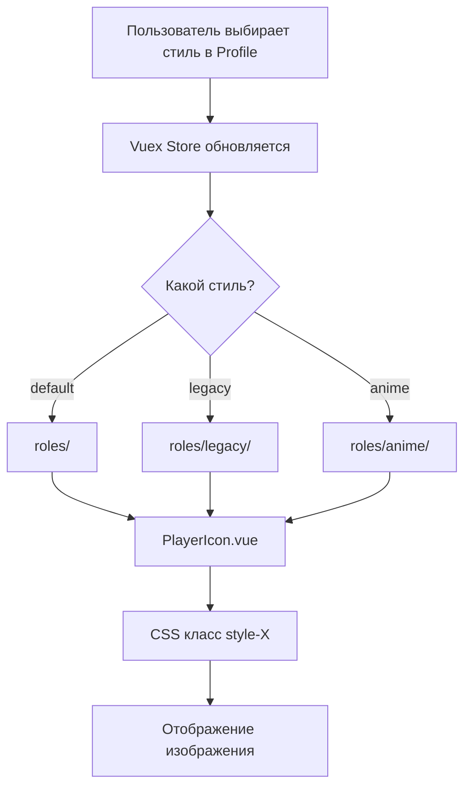

# План добавления Legacy Mode для изображений ролей

## Обзор задачи

Необходимо добавить возможность выбора стиля изображений ролей с тремя вариантами:

- **Default** (Стандартный) - текущие изображения
- **Legacy** (Классический) - старые изображения из оригинальной игры
- **Anime** (Аниме) - аниме-стиль изображений

Текущая реализация использует чекбокс для переключения между default и anime. Нужно заменить его на селектор с тремя вариантами.

## Текущее состояние

### Уже реализовано:

1. Legacy изображения загружены в `packages/ui/src/assets/images/roles/legacy/` (7 ролей: merlin, minion, mordred, morgana, oberon, percival, servant)
2. Стили `.style-legacy` уже добавлены в `PlayerIcon.vue` для этих 7 ролей
3. Anime mode полностью работает

### Требуется изменить:

1. Интерфейс настроек пользователя
2. Функции работы с изображениями
3. Компонент профиля
4. Переводы

---

## Детальный план изменений

### 1. Обновить интерфейс IUserSettings

**Файл:** `packages/ui/src/store/interface.ts`

**Изменение:**

```typescript
// Было:
style?: 'default' | 'anime';

// Станет:
style?: 'default' | 'legacy' | 'anime';
```

---

### 2. Обновить функцию getImagePathByID

**Файл:** `packages/ui/src/helpers/images/index.ts`

**Изменение:**

```typescript
// Было:
export const getImagePathByID = (type: 'roles' | 'roles/anime' | 'features' | 'core' | 'other', id: string): string => {

// Станет:
export const getImagePathByID = (type: 'roles' | 'roles/legacy' | 'roles/anime' | 'features' | 'core' | 'other', id: string): string => {
```

---

### 3. Обновить функцию calculateRoleUrl

**Файл:** `packages/ui/src/helpers/styles/index.ts`

**Важно:** Legacy изображения существуют только для 7 ролей. Для остальных ролей нужен fallback на стандартные изображения.

**Изменение:**

```typescript
// Было:
export function calculateRoleUrl(role: TVisibleRole): string {
  let type: 'roles' | 'roles/anime' = 'roles';

  if (store.state.settings?.style === 'anime') {
    type = 'roles/anime';
  }

  return getImagePathByID(type, snakeCase(role));
}

// Станет:
// Список ролей, для которых есть legacy изображения
const LEGACY_ROLES = ['merlin', 'minion', 'mordred', 'morgana', 'oberon', 'percival', 'servant'];

export function calculateRoleUrl(role: TVisibleRole): string {
  const style = store.state.settings?.style;
  const roleSnake = snakeCase(role);

  if (style === 'anime') {
    return getImagePathByID('roles/anime', roleSnake);
  }

  // Для legacy проверяем, есть ли изображение для этой роли
  if (style === 'legacy' && LEGACY_ROLES.includes(roleSnake)) {
    return getImagePathByID('roles/legacy', roleSnake);
  }

  return getImagePathByID('roles', roleSnake);
}
```

**Примечание о CSS fallback:**
В `PlayerIcon.vue` CSS каскад автоматически обеспечивает fallback:

- Базовые стили определяют изображения для ВСЕХ ролей
- `.style-legacy` переопределяет только 7 ролей с legacy изображениями
- Для остальных ролей используются базовые стили (default изображения)

---

### 4. Обновить функцию computedStyles

**Файл:** `packages/ui/src/helpers/styles/index.ts`

**Изменение:**

```typescript
// Было:
export function computedStyles(): string[] {
  if (store.state.settings?.style === 'anime') {
    return ['anime-style'];
  }

  return [];
}

// Станет:
export function computedStyles(): string[] {
  const style = store.state.settings?.style;

  if (style === 'anime') {
    return ['anime-style'];
  }

  if (style === 'legacy') {
    return ['legacy-style'];
  }

  return [];
}
```

---

### 5. Обновить Profile.vue - заменить чекбокс на селектор

**Файл:** `packages/ui/src/pages/profile/Profile.vue`

**Изменения в template:**

```vue
<!-- Было: -->
<v-checkbox v-model="style" :hide-details="true" :label="$t('profile.animeMode')"> </v-checkbox>

<!-- Станет: -->
<v-select
  :label="$t('profile.imageStyle')"
  :items="availableStyles"
  class="w-100 mb-4"
  v-model="imageStyle"
  hide-details="auto"
></v-select>
```

**Изменения в computed:**

```typescript
// Было:
style: {
  get() {
    return this.$store.state.settings?.style === 'anime';
  },
  set(value: boolean) {
    this.$store.commit('updateUserSettings', { key: 'style', value: value ? 'anime' : 'default' });
  },
},

// Станет:
imageStyle: {
  get() {
    return this.$store.state.settings?.style || 'default';
  },
  set(value: 'default' | 'legacy' | 'anime') {
    this.$store.commit('updateUserSettings', { key: 'style', value });
  },
},
availableStyles() {
  return [
    {
      value: 'default',
      title: this.$t('profile.styleDefault'),
    },
    {
      value: 'legacy',
      title: this.$t('profile.styleLegacy'),
    },
    {
      value: 'anime',
      title: this.$t('profile.styleAnime'),
    },
  ];
},
```

---

### 6. Добавить переводы

#### Русский (ru/ui.ts)

```typescript
profile: {
  // ... существующие переводы
  imageStyle: 'Стиль изображений',
  styleDefault: 'Стандартный',
  styleLegacy: 'Классический',
  styleAnime: 'Аниме',
}
```

#### Английский (en/ui.ts)

```typescript
profile: {
  // ... существующие переводы
  imageStyle: 'Image style',
  styleDefault: 'Default',
  styleLegacy: 'Legacy',
  styleAnime: 'Anime',
}
```

#### Испанский (es/ui.ts)

```typescript
profile: {
  // ... существующие переводы
  imageStyle: 'Estilo de imagen',
  styleDefault: 'Estándar',
  styleLegacy: 'Clásico',
  styleAnime: 'Anime',
}
```

#### Португальский (pt/ui.ts)

```typescript
profile: {
  // ... существующие переводы
  imageStyle: 'Estilo de imagem',
  styleDefault: 'Padrão',
  styleLegacy: 'Clássico',
  styleAnime: 'Anime',
}
```

#### Китайский упрощённый (zh_CN/ui.ts)

```typescript
profile: {
  // ... существующие переводы
  imageStyle: '图像风格',
  styleDefault: '标准',
  styleLegacy: '经典',
  styleAnime: '动漫',
}
```

#### Китайский традиционный (zh_TW/ui.ts)

```typescript
profile: {
  // ... существующие переводы
  imageStyle: '圖像風格',
  styleDefault: '標準',
  styleLegacy: '經典',
  styleAnime: '動漫',
}
```

---

### 7. Проверить стили в других компонентах

**Файлы для проверки:**

- `packages/ui/src/components/view/board/game/Game.vue` - содержит `.anime-style.icon-witch-hidden`
- `packages/ui/src/components/view/board/game/modules/Mission.vue` - содержит `.anime-style.mission-hidden`

Эти компоненты используют anime-style для специфичных случаев (скрытая ведьма). Для legacy mode эти стили не требуются, так как legacy изображения не включают witch.

---

## Диаграмма потока данных



---

## Файлы для изменения

| Файл                                        | Тип изменения                              |
| ------------------------------------------- | ------------------------------------------ |
| `packages/ui/src/store/interface.ts`        | Обновить тип style                         |
| `packages/ui/src/helpers/images/index.ts`   | Добавить тип roles/legacy                  |
| `packages/ui/src/helpers/styles/index.ts`   | Обновить calculateRoleUrl и computedStyles |
| `packages/ui/src/pages/profile/Profile.vue` | Заменить чекбокс на селектор               |
| `packages/ui/src/i18n/langs/ru/ui.ts`       | Добавить переводы                          |
| `packages/ui/src/i18n/langs/en/ui.ts`       | Добавить переводы                          |
| `packages/ui/src/i18n/langs/es/ui.ts`       | Добавить переводы                          |
| `packages/ui/src/i18n/langs/pt/ui.ts`       | Добавить переводы                          |
| `packages/ui/src/i18n/langs/zh_CN/ui.ts`    | Добавить переводы                          |
| `packages/ui/src/i18n/langs/zh_TW/ui.ts`    | Добавить переводы                          |

---

## Примечания

1. **Legacy изображения ограничены**: Только 7 ролей имеют legacy изображения. Для остальных ролей будут использоваться стандартные изображения (fallback).

2. **Обратная совместимость**: Существующие пользователи с `style: 'anime'` или `style: 'default'` продолжат работать без изменений.

3. **Удаление старого перевода**: Ключ `animeMode` можно оставить для обратной совместимости или удалить, так как он больше не используется.
